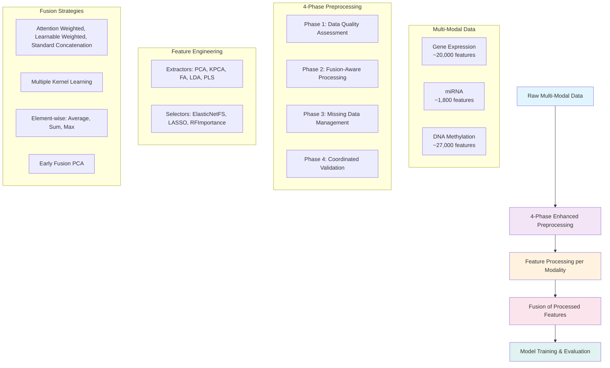

# Robust Multi-Omics Integration: Comparative Analysis of Feature Engineering and Intermediate Fusion Techniques for Cancer Prediction

[](https://www.python.org/downloads/)
[](https://opensource.org/licenses/MIT)
[](https://github.com/kpnowak/OUH-Internship-Krzysztof-Nowak)

## Project Overview

This repository contains a comprehensive machine learning pipeline for **robust multi-omics integration** using intermediate fusion techniques. This project is part of a Bachelor's Thesis in Artificial Intelligence at VU Amsterdam, focusing on comparative analysis of feature engineering and intermediate fusion techniques for cancer prediction. It contributes to a larger research initiative focused on developing advanced machine learning models for early 
and accurate cancer detection.

The pipeline investigates **fusion techniques** and **feature engineering algorithms** for multi-omics cancer data, implementing an **intermediate integration approach** where feature processing is applied to each modality separately **before** fusion occurs.

### Research Context & Objectives

**Primary Goal**: Test fusion techniques and feature engineering algorithms (with emphasis on fusion techniques) and analyze how they interact with different models, missing data percentages, and feature/component numbers.

**Research Objectives**:
1. **Evaluate** fusion techniques and feature engineering algorithms across diverse scenarios
2. **Analyze** interactions between fusion methods, models, and data conditions
3. **Investigate** performance under different missing data percentages (0%, 20%, 50%)
4. **Study** impact of feature/component numbers on algorithm performance
5. **Determine** optimal combinations for multi-omics cancer data analysis

### Processing Approach: Intermediate Integration

The pipeline implements an **intermediate integration approach** for multi-omics data analysis:

```
🧬 Raw Multi-Omics Data → 🔧 Feature Processing (per modality) → 🔗 Fusion → 🤖 Model Training
```

**Why Intermediate Integration?**
- **Modality-Specific Optimization**: Each data type gets specialized preprocessing
- **Better Feature Quality**: Fusion works with clean, optimized features rather than noisy raw data
- **Improved Interpretability**: Clear understanding of individual modality contributions
- **Computational Efficiency**: Parallel processing of modalities possible

## Data Types & Scope

### Multi-Omics Cancer Data
- **Gene Expression (exp.csv)**: ~20,000 transcriptomic features measuring mRNA levels
- **miRNA (mirna.csv)**: ~1,800 microRNA features for post-transcriptional regulation
- **Methylation (methy.csv)**: ~27,000 DNA methylation features indicating epigenetic modifications
- **Clinical Data**: Patient outcomes and clinical variables for supervised learning

### Datasets
**Regression Tasks** (Continuous Outcomes):
- **AML**: Acute Myeloid Leukemia blast cell percentage prediction
- **Sarcoma**: Tumor length prediction

**Classification Tasks** (Categorical Outcomes):
- **Breast, Colon, Kidney, Liver, Lung, Melanoma, Ovarian**: Pathologic T-stage and clinical stage classification

*Source: Rappoport & Shamir (2018), Nucleic Acids Research*

## Pipeline Architecture

### 🏗️ Intermediate Integration Processing Workflow



### 🔄 4-Phase Enhanced Preprocessing

**Phase 1: Early Data Quality Assessment**
- Automated quality scoring (0.0-1.0 scale)
- Data orientation validation (samples × features)
- Baseline metric computation
- Preprocessing strategy recommendations

**Phase 2: Fusion-Aware Processing**
- Adaptive preprocessing order based on fusion method
- Modality-specific scaling strategies
- Numerical stability checks

**Phase 3: Centralized Missing Data Management** 
- Intelligent missing pattern analysis
- Adaptive imputation strategies (KNN, Iterative, Simple)
- Missing percentage-based method selection

**Phase 4: Coordinated Validation Framework**
- Task-appropriate cross-validation strategies
- Patient-level grouping for medical data
- Hierarchical validation with fail-fast reporting

## Algorithm Portfolio

### 🧮 Feature Engineering Methods (6 types per task)

**Regression Extractors (6):**
| Algorithm | Description | Use Case |
|-----------|-------------|----------|
| **PCA** | Principal Component Analysis | Linear dimensionality reduction |
| **KPCA** | Kernel PCA with RBF kernel | Non-linear dimensionality reduction |
| **FA** | Factor Analysis | Latent factor modeling |
| **PLS** | Partial Least Squares | Supervised reduction for regression |
| **KPLS** | Kernel PLS | Non-linear supervised reduction |
| **SparsePLS** | Sparse Partial Least Squares | Sparse feature discovery |

**Classification Extractors (6):**
| Algorithm | Description | Use Case |
|-----------|-------------|----------|
| **PCA** | Principal Component Analysis | Linear dimensionality reduction |
| **KPCA** | Kernel PCA with RBF kernel | Non-linear dimensionality reduction |
| **FA** | Factor Analysis | Latent factor modeling |
| **LDA** | Linear Discriminant Analysis | Supervised classification reduction |
| **PLS-DA** | Partial Least Squares Discriminant Analysis | Supervised classification reduction |
| **SparsePLS** | Sparse Partial Least Squares | Sparse feature discovery |

### 🎯 Feature Selection Methods (5 types per task)

**Regression Selectors (5):**
| Algorithm | Description | Strength |
|-----------|-------------|-----------|
| **ElasticNetFS** | ElasticNet-based selection | L1/L2 regularization balance |
| **RFImportance** | Random Forest importance | Tree-based feature ranking |
| **VarianceFTest** | F-test based selection | Statistical significance |
| **LASSO** | L1-regularized selection | Automatic feature pruning |
| **f_regressionFS** | F-statistic regression selection | Regression-specific statistics |

**Classification Selectors (5):**
| Algorithm | Description | Strength |
|-----------|-------------|-----------|
| **ElasticNetFS** | ElasticNet-based selection | L1/L2 regularization balance |
| **RFImportance** | Random Forest importance | Tree-based feature ranking |
| **VarianceFTest** | F-test based selection | Statistical significance |
| **LASSO** | L1-regularized selection | Automatic feature pruning |
| **LogisticL1** | Logistic regression with L1 penalty | Classification-specific selection |

### 🔗 Fusion Strategies

**Clean Data (0% missing) - 8 Methods:**
- **Attention Weighted**: Neural attention for sample-specific weighting
- **Learnable Weighted**: Performance-based modality weighting
- **Multiple Kernel Learning (MKL)**: RBF kernel combination
- **Average/Sum/Max**: Element-wise operations for robust baseline
- **Standard Concatenation**: Direct feature concatenation
- **Early Fusion PCA**: Concatenate then dimensionality reduction

**Missing Data (>0% missing) - 5 Robust Methods:**
- **MKL**: Robust kernel-based fusion
- **Average/Sum/Max**: Handle missing modalities gracefully
- **Early Fusion PCA**: Simple and robust with imputation

### 🤖 Machine Learning Models (3 per task)

**Regression Models (3):**
- **LinearRegression**: Linear baseline model
- **ElasticNet**: L1/L2 regularized regression
- **RandomForestRegressor**: Ensemble tree-based regression

**Classification Models (3):**
- **LogisticRegression**: Linear classification baseline
- **RandomForestClassifier**: Ensemble tree-based classification
- **SVC**: Support Vector Classification

*All models use pre-tuned hyperparameters stored in `hp_best/` directory*

## Experimental Design

### 🔬 Comprehensive Evaluation Framework

The pipeline implements a **4-level nested experimental loop** to test interactions between fusion techniques, feature engineering algorithms, models, and data conditions:

```python
for missing_percentage in [0%, 20%, 50%]:           # Missing data scenarios
    for algorithm in [extractors + selectors]:      # 14 feature engineering algorithms  
        for n_features in [8, 16, 32]:             # Feature/component counts
            for fusion_method in fusion_methods:    # 8 methods (clean) / 5 methods (missing)
                for model in models:                # 3 models per task
                    # Run complete experiment with 5-fold CV
```

**Experimental Scope**:
- **Total Combinations**: ~2,640 experiments per dataset
- **Fusion Techniques**: 8 methods for clean data, 5 methods for missing data
- **Feature Engineering**: 6 extractors + 5 selectors per task type
- **Models**: 3 models per task (regression/classification)
- **Missing Data**: 3 scenarios (0%, 20%, 50%)
- **Cross-Validation**: 5-fold stratified (classification) / standard (regression)
- **Evaluation Metrics**: 
  - Regression: R², MSE, MAE
  - Classification: Accuracy, F1, MCC, AUC
- **Statistical Analysis**: Mean ± standard deviation across folds

### 📊 Performance Optimization Features

- **Hyperparameter Tuning**: Pre-optimized parameters for all algorithm combinations
- **Intelligent Caching**: LRU cache system prevents redundant computations
- **Memory Management**: Adaptive strategies for large datasets
- **Parallel Processing**: Multi-core utilization for cross-validation

## Installation & Setup

### 🚀 Quick Start

```bash
# Clone the repository
git clone https://github.com/kpnowak/OUH-Internship-Krzysztof-Nowak.git
cd OUH-Internship-Krzysztof-Nowak
```

### 📦 Installation Options

You have **2 installation options**:

#### **Option 1: Conda Environment (Recommended)**

**Step 1: Create and activate conda environment**
```bash
# Create environment from environment.yml
conda env create -f environment.yml

# Activate the environment
conda activate OUH_final_project
```

**Step 2: Verify installation**
```bash
# Test installation
python setup_and_info/test_installation.py

# Quick functionality test
python main.py --help
```

**To deactivate conda environment:**
```bash
conda deactivate
```

#### **Option 2: Direct Installation with install.py**

**Step 1: Run interactive installer**
```bash
# Run the interactive installation script
python install.py
```

**Step 2: Choose installation type**
The script will prompt you to choose from 5 installation modes:

1. **Basic Installation**: Core dependencies only
2. **Visualization**: Core + enhanced plotting capabilities  
3. **Development**: Core + development tools (pytest, black, mypy)
4. **Advanced**: Core + experimental fusion libraries (SNF, MKL)
5. **Full Installation**: All dependencies

**Step 3: Automatic verification**
The `install.py` script automatically runs `test_installation.py` to verify the installation.

### ✅ Verify Installation

```bash
# Test installation (if not using install.py)
python setup_and_info/test_installation.py

# Quick functionality test
python main.py --help
```

## Usage

### 🎮 Basic Execution

```bash
# Default: Intermediate integration approach (RECOMMENDED)
python main.py

# Memory-optimized sequential processing
python main.py --sequential

# Legacy fusion-first approach (for comparison)
python main.py --fusion-first
```

### 🎯 Targeted Execution

```bash
# Specific datasets
python main.py --dataset AML                    # Single dataset
python main.py --regression-only                # AML + Sarcoma
python main.py --classification-only            # All classification datasets

# Parameter control
python main.py --n-val 16                       # Specific feature count
python main.py --debug                          # Verbose logging

# Analysis control
python main.py --mad-only                       # Statistical analysis only
python main.py --skip-mad                       # Skip statistical analysis
```

### 🏗️ Architecture Comparison

| Architecture | Command | Order | Best For |
|-------------|---------|-------|----------|
| **Intermediate Integration** (Default) | `python main.py` | Raw → Feature → Fusion → Model | Standard analysis |
| **Sequential** (Memory-friendly) | `python main.py --sequential` | One algorithm at a time | Large datasets |
| **Fusion-First** (Legacy) | `python main.py --fusion-first` | Raw → Fusion → Feature → Model | Research comparison |

## Results & Output

### 📁 Output Structure

The pipeline generates results in **two separate folders**:

#### **📊 Raw Results (`output/`)**
Contains all experimental results from **10,206 combinations tested**:
```
output/
├── classification/
│   ├── [Dataset]/                         # Raw experimental results per dataset
│   │   ├── extractor_rankings.csv        # Algorithm performance rankings
│   │   ├── fusion_technique_rankings.csv # Fusion method rankings
│   │   ├── top_50_combinations_*.csv     # Best combinations by scenario
│   │   └── detailed_results/              # Individual experiment results
│   └── combined/                          # Cross-dataset analysis
└── regression/
    └── [Similar structure for regression tasks]
```

#### **📈 Analyzed Results (`results/`)**
Contains **analyzed and processed results** from the `output/` folder:
```
results/
├── classification/
│   ├── combined/                          # Cross-dataset rankings
│   │   ├── extractor_rankings.csv        # Analyzed algorithm rankings
│   │   ├── fusion_technique_rankings.csv # Analyzed fusion rankings
│   │   └── top_50_combinations_*.csv     # Best combinations by scenario
│   └── [Dataset]/                        # Per-dataset analyzed results
├── regression/
│   └── [Similar structure for regression tasks]
├── combined_analysis_plots_grid.png       # Combined visualization
└── numbered_classification_plots.png      # Numbered plot legend
```

### 📈 Key Performance Metrics

**Classification**: MCC (primary), Accuracy, F1, AUC, Fit Time
**Regression**: R² (primary), MSE, MAE, Fit Time

### 🏆 Results Analysis Features

- **Algorithm Rankings**: Performance-based ranking across all datasets
- **Statistical Significance**: Critical difference analysis
- **Missing Data Impact**: Performance comparison across missing percentages
- **Computational Efficiency**: Training time vs. performance analysis
- **Best Combinations**: Top-performing algorithm+fusion+model combinations

## Advanced Configuration

### ⚙️ Core Settings (`config.py`)

```python
# Missing data scenarios
MISSING_MODALITIES_CONFIG = {
    "missing_percentages": [0.0, 0.2, 0.5]
}

# Feature selection parameters
N_VALUES_LIST = [8, 16, 32]

# Memory optimization
MEMORY_OPTIMIZATION = {
    "cache_limit_mb": 4000,
    "max_parallel_jobs": -1
}
```

### 🔧 Modality-Specific Preprocessing

```python
# Gene expression configuration
"Gene Expression": {
    "enhanced_sparsity_handling": True,
    "smart_skewness_correction": True,
    "enable_log_transform": True,
    "outlier_threshold": 4.0
}

# miRNA-specific settings
"miRNA": {
    "sparsity_threshold": 0.9,
    "zero_inflation_handling": True,
    "biological_knn_imputation": True
}
```

## System Requirements

### 💻 Hardware Recommendations

- **Memory**: 8GB+ RAM (16GB+ recommended for large datasets)
- **CPU**: Multi-core processor (4+ cores recommended)
- **Storage**: SSD recommended for faster I/O
- **OS**: Windows, macOS, or Linux

### ⚡ Performance Characteristics

- **Processing Time**: 30 minutes - 4 hours per dataset (depending on size)
- **Memory Usage**: 2-8GB RAM per dataset
- **Cache Storage**: 1-4GB disk space for intermediate results
- **Parallel Efficiency**: Scales well with CPU cores

## Repository Structure

```
OUH-Internship-Krzysztof-Nowak/
├── 📋 Core Pipeline
│   ├── main.py                             # Main entry point
│   ├── cli.py                              # Command-line interface
│   ├── feature_first_pipeline.py           # Feature-first implementation
│   └── config.py                           # Configuration settings
├── 🔧 Processing Modules
│   ├── data_io.py                          # Data loading & validation
│   ├── preprocessing.py                    # Biomedical preprocessing
│   ├── models.py                           # ML models & feature processing
│   ├── fusion.py                           # Multi-modal fusion strategies
│   └── cv.py                               # Cross-validation pipeline
├── 🏗️ Architecture Components
│   ├── enhanced_pipeline_integration.py    # 4-phase coordinator
│   ├── data_quality_analyzer.py            # Quality assessment
│   ├── missing_data_handler.py             # Missing data management
│   └── validation_coordinator.py           # Validation framework
├── 📊 Analysis & Utilities
│   ├── enhanced_evaluation.py              # Evaluation metrics
│   ├── mad_analysis.py                     # Statistical analysis
│   ├── plots.py                            # Visualization
│   └── utils.py                            # Utility functions
├── 🗂️ Data & Results
│   ├── data/                               # Multi-omics datasets
│   ├── hp_best/                            # Pre-tuned hyperparameters
│   ├── results/                            # Experimental results
│   └── data_quality_analysis/              # Quality reports
├── ⚙️ Setup & Configuration
│   ├── setup_and_info/                     # Installation files
│   ├── requirements.txt                    # Dependencies
│   └── install.py                          # Installation script
└── 📚 Documentation
    ├── README.md                           # This file
    └── instructions/                       # Technical documentation
```

## Recent Enhancements

### 🆕 Version 4.0 - Intermediate Integration Implementation
- ✅ **Intermediate Integration Approach**: Complete implementation as default
- ✅ **Enhanced Experimental Loop**: Systematic algorithm→features→fusion→model evaluation
- ✅ **Dual Architecture Support**: Intermediate integration + legacy fusion-first available
- ✅ **Memory Optimization**: Sequential processing for large datasets

### 🔧 Version 3.1 - Robustness & Stability
- ✅ **Task-Appropriate CV**: Proper regression/classification strategies
- ✅ **Algorithm Robustness**: Multi-level fallbacks for numerical stability
- ✅ **Enhanced Error Handling**: Graceful degradation with comprehensive logging

### 🏗️ Version 3.0 - 4-Phase Architecture
- ✅ **4-Phase Integration**: Quality→Processing→Missing→Validation pipeline
- ✅ **Missing Data Intelligence**: Adaptive fusion strategy selection
- ✅ **Pre-tuned Hyperparameters**: Optimized parameters for immediate performance

## Contributing & Support

### 📞 Getting Help

1. **Installation Issues**: Run `python setup_and_info/test_installation.py`
2. **Execution Problems**: Use `python main.py --debug` for detailed logging
3. **Memory Issues**: Try `python main.py --sequential` for memory-friendly processing
4. **Performance Questions**: Check `results/` directory for analysis outputs

### 🤝 Contributing

This project is part of ongoing research. For questions, suggestions, or contributions, please contact the research team at VU Amsterdam.

### 📚 Documentation

- **Technical Details**: See `instructions/` directory for implementation specifics
- **API Reference**: Comprehensive docstrings in all modules
- **Configuration Guide**: See `config.py` for all customizable parameters

## Citation & Acknowledgments

### 📖 Citation

```bibtex
@misc{nowak2025_multiomics_fusion,
  title={Multi-Omics Data Fusion Optimization using Feature-First Integration},
  author={Krzysztof Nowak},
  year={2025},
  institution={VU Amsterdam},
  type={Bachelor's Thesis},
  url={https://github.com/kpnowak/OUH-Internship-Krzysztof-Nowak}
}
```

### 🙏 Acknowledgments

- **VU Amsterdam** Faculty of Science
- **Research Supervisors** and collaborators
- **The Cancer Genome Atlas (TCGA)** for providing datasets
- **Open-source Python community** for foundational libraries

## License

This project is licensed under the MIT License - see the LICENSE file for details.

---

<div align="center">

**🧬 Robust Multi-Omics Integration for Cancer Prediction 🧬**

*VU Amsterdam • Bachelor's Thesis in Artificial Intelligence • 2025*

</div> 